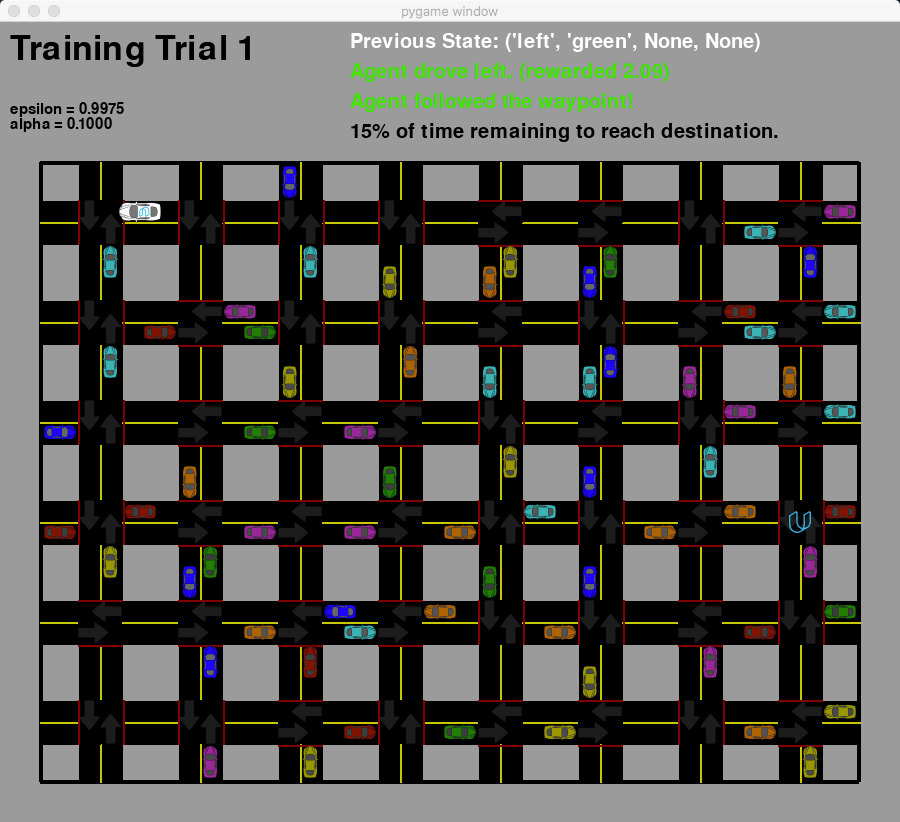

## Smartcab Project

This project explores the reinforcement learning technique of [Q-learning](https://en.wikipedia.org/wiki/Q-learning) to help an automated cab safely reach its destination in an appropriate amount of time. The environment the cab is in consists of a grid of streets and the cab must learn the best actions to take at a given intersection based on sensory data such as whether a stop light is green or red and what direction other cars are traveling at the intersection.

This project is using Python 2.7 and needs the following libraries:

* pygame
* jupyter notebook

Pygame can be a little tricky to get working in Python 2.7 but is not technically required to run the program. It allows a visualization of the decisions the Smartcab is making as it drives in the environment. To turn off the visualization set the `display` flag equal to `False` on line 197 of the [smartcab/agent.py](smartcab/agent.py) file. If you would like to install pygame this [link](https://www.pygame.org/wiki/GettingStarted) might be helpful in getting it installed. I have found using `pip install pygame` and `brew install sdl sdl_image sdl_mixer sdl_ttf smpeg portmidi` (if you use [Homebrew](https://brew.sh/)) to be successful in installing the package.

To launch the program and see the Smartcab start learning the best actions to take run the following from the root of the project:

```python smartcab/agent.py```

The analysis of how the Smartcab used Q-learning can be found in a Jupyter notebook and can be run using the following from a terminal:

```jupyter notebook smartcab.ipynb```

Here is a screenshot of the Smartcab driving through the city in pygame (Smartcab is white vehicle):


